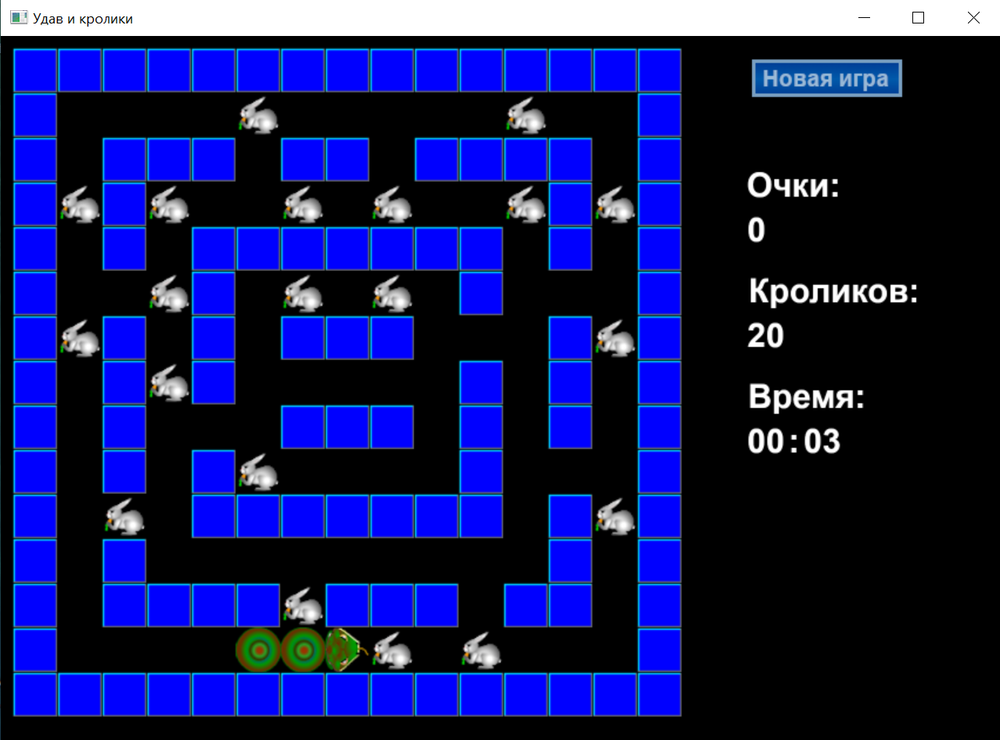

# Snake
 


## Создание игры
При создании компьютерной игры 
использовалась графическая библиотека **OpenGL**,
язык программирования **C++**.
## Алгоритм игры
Основу игры составляют игровое поле, а также векторы
с кроликами и телом змеи. Размер и содержимое игрового
поля считывается из файла ([Игровое поле](SnakeOGL/map1)).  

Вектор удава содержит координаты, начиная с хвоста и заканчивая головой.
Для перемещения змеи используется удаление **первого элемента (хвоста)** и
добавление новой позиции в **конец вектора (голову)**. Если в данный момент 
времени удав должен увеличиться в размерах (вырасти), удаление первого
элемента **не выполняется**.

Пользователь имеет возможность изменять направление движения змеи,
для этого используется параметр типа ***Direction***, а также автоматически
устанавливаемый флаг останова движения.
```c++
enum Direction {dXplus, dXminus, dYplus, dYminus};
```
При каждом шаге игры выполняются следующие действия:
1. Выбирается последний элемент вектора (координаты головы удава).
2. Данные координаты изменяются согласно направлению движения, таким образом,
получается новое положение головы удава.
3. Новые координаты добавляются в конец списка.
4. Удаляется элемент из хвоста, если не задан рост змеи.
5. Проверяется, свободна ли клетка, куда хочет переместиться удав. Если клетка
занята стеной - змея останавливается, если клетка занята телом змеи - игра завершается.
6. Если клетка занята кроликом, то кролик удаляется из вектора и увеличивается
значение переменной ***grow***. Благодаря этому, змея увеличивается в размерах.
7. Проверяется условие победы - отсутствие кроликов в векторе.


