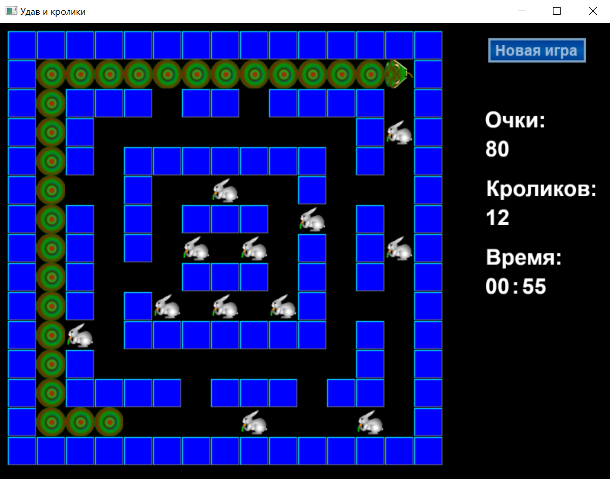
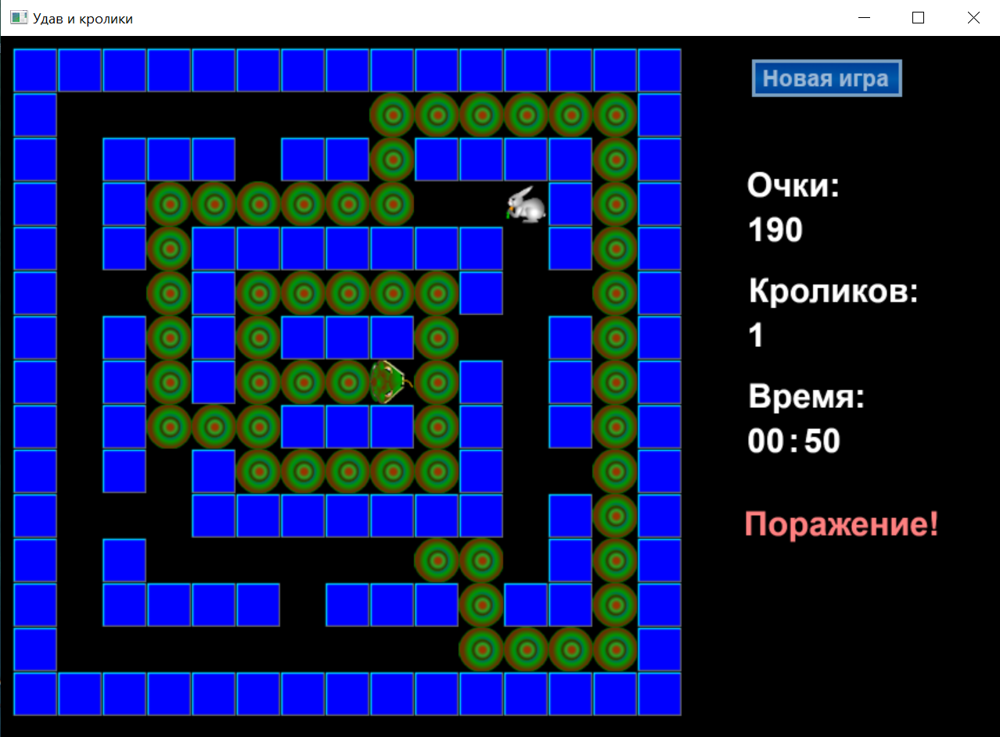
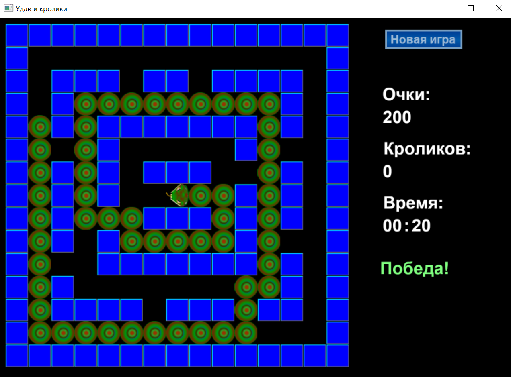

# Snake 🐍
 


## Создание игры 👷🏻‍♂️
При создании компьютерной игры 
использовалась графическая библиотека **OpenGL**,
язык программирования **C++**.
## Алгоритм игры 📈
Основу игры составляют игровое поле, а также векторы
с кроликами и телом змеи. Размер и содержимое игрового
поля считывается из файла ([Игровое поле](SnakeOGL/map1)).  

Вектор удава содержит координаты, начиная с хвоста и заканчивая головой.
Для перемещения змеи используется удаление **первого элемента (хвоста)** и
добавление новой позиции в **конец вектора (голову)**. Если в данный момент 
времени удав должен увеличиться в размерах (вырасти), удаление первого
элемента **не выполняется**.

Пользователь имеет возможность изменять направление движения змеи,
для этого используется параметр типа ***Direction***, а также автоматически
устанавливаемый флаг останова движения.
```c++
enum Direction {dXplus, dXminus, dYplus, dYminus};
```
При каждом шаге игры выполняются следующие действия:
1. Выбирается последний элемент вектора (координаты головы удава).
2. Данные координаты изменяются согласно направлению движения, таким образом,
получается новое положение головы удава.
3. Новые координаты добавляются в конец списка.
4. Удаляется элемент из хвоста, если не задан рост змеи.
5. Проверяется, свободна ли клетка, куда хочет переместиться удав. Если клетка
занята стеной - змея останавливается, если клетка занята телом змеи - игра завершается.
6. Если клетка занята кроликом, то кролик удаляется из вектора и увеличивается
значение переменной ***grow***. Благодаря этому, змея увеличивается в размерах.
7. Проверяется условие победы - отсутствие кроликов в векторе.

Время в игре выводится в виде пары ***"минуты:секунды"***. Для улучшения игрового
процесса отображаются очки (которые заработал игрок), оставшееся количество кроликов.

Картинки, отображаемые в процессе игры, хранятся в виде файлов 
с **расширением BMP**. Изображения могут быть отредактированы, но их размеры
и формат должны быть сохранены.

## Игровое управление 🎮
Библиотека GLUT (надстройка над OpenGL) предоставляет функцию
***glutSpecialFunc(specialKeys)***, которая позволяет зарегистрировать обработку нажатия специальных
клавиш. Специальные клавиши в данной игре - элементы управления движением удава (стрелки вверх, 
вниз, влево, вправо).

Обработка специальных клавиш:
```c++
void specialKeys( int key, int x, int y ) {
 // Стрелки на управление 
  if (key == GLUT_KEY_RIGHT)
	  snake->rotRight() ;
  else if (key == GLUT_KEY_LEFT)
    snake->rotLeft() ;
  else if (key == GLUT_KEY_UP)
    snake->rotUp() ;
  else if (key == GLUT_KEY_DOWN)
    snake->rotDown() ;
  glutSetWindow(mainWindow);  
  glutPostRedisplay();		 
}
```
Работа с мышью осуществляется при помощи команды ***glutMouseFunc(mouseFunc)***, которая
позволяет зарегистрировать обработку событий от мыши.

Обработка событий от мыши:
```c++
// Функция мыши, отработка клика новой игры
void mouseFunc(int button, int state, int x, int y) {
 if ((button == GLUT_LEFT_BUTTON)&&(state == GLUT_UP)) {
	if ((x >= BUTNEWX) && (x <= BUTNEWX+butnew.width) && (y >= BUTNEWY) && (y <= BUTNEWY+butnew.height))
	  snake = new Snake(tekfile) ;
	}
}
```
В программном коде предусмотрена возможность регулировки скорости 
движения удава. За скорость движения удава отвечает переменная ***MSEC_UPD***.
Изменив значение данной переменной, мы изменяем скорость движения змеи.
```c++
// Этот параметр отвечает за то, сколько миллисекунд отводится на один шаг.
const int MSEC_UPD = 70;
```

## Игровой интерфейс 🖥️






## Помощь с проектом
<table>
    <tr>
        <td>
            Если Вам понравился данный проект, поставьте ⭐ этому репозиторию.
        </td>
    </tr>
</table>


